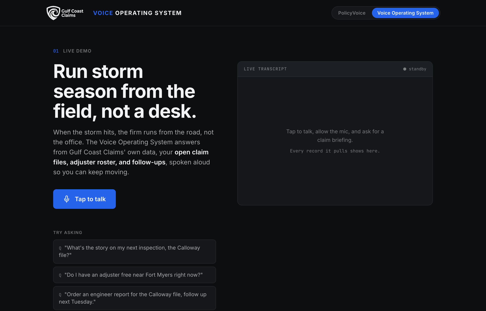

# PolicyVoice

**The policy library that talks back.** A forwardable voice-AI demo for independent insurance claims firms. An adjuster on a storm-damaged roof calls one line, asks a coverage question out loud, and hears the **exact policy wording read back word for word**, with the form and page it came from. Never a summary, never a coverage call. The page is built to explain itself in about 90 seconds without anyone presenting it.



Stand-in customer: **Gulf Coast Claims**, an independent claims firm. The page has two products on one backend:

1. **PolicyVoice** (default tab) — voice over insurance policy wording: coverage clauses, exclusions, and endorsements, read back verbatim for adjusters in the field.
2. **Voice Operating System** (second tab) — voice over the firm's own operations data: claim-file briefings, the adjuster roster, and follow-up capture, for the owner running storm season from the road.

Remixed from the RTL/ShopVoice voice-assistant architecture (Vapi + Express + flat-file data). Some internal identifiers still use the legacy names `shopvoice` / `invan`; they are not user-facing.

## Architecture

```
Browser (index.html, Vapi Web SDK tap-to-talk)
  → Vapi (STT/TTS + GPT-4o function calling)
    → Express server (mcp-servers/unified-server.js)
      → flat-file demo corpus
```

### Backend endpoints

**PolicyVoice**

| Endpoint | Purpose |
|---|---|
| `POST /lookup-coverage` | Find the policy clause for a topic; return the exact wording with form, section, and page. |
| `POST /lookup-endorsement` | Find an endorsement/add-on by topic; return its exact wording and how it modifies the base form. |
| `POST /search-policy` | Keyword-scored search over the full policy sections (Section I, III, IV/V), chunked on `##` / `###` headers. |

**Voice Operating System**

| Endpoint | Purpose |
|---|---|
| `POST /briefing` | Claim-file briefing by claim number, claimant, or location. |
| `POST /roster-check` | Adjuster availability by region. |
| `POST /capture-task` | Log a follow-up/dispatch/note against a claim (in-memory for the demo). |

**Shared**

| Endpoint | Purpose |
|---|---|
| `GET /health` | Counts of clauses, endorsements, policy-form chunks, open claims, and adjusters. |
| `POST /reload` | Reload all data sources without restarting. |
| `GET /data/clauses` `/data/endorsements` `/data/policy-forms` | Read-only views of the PolicyVoice corpus. |
| `GET /data/claims` `/data/roster` `/data/tasks` | Read-only views of the Voice Operating System data. |

### Corpus

PolicyVoice reads from a real document: the **SE Mutual Homeowner's Package Policy (Comprehensive Form)**, an all-risks homeowner's policy. The wording and page numbers in the corpus are taken from that PDF, so the agent's quotes and citations match the source.

- `mcp-servers/policy-context/policy-database.json` — 9 indexed coverage clauses (all-risks insuring agreement, water/sewer backup, flood & waves, wind-driven rain to interior, fungi & mould, by-law/increased cost, additional living expense, basis of claim payment & deductible, requirements after loss) with verbatim text and the section + page each came from.
- `mcp-servers/endorsement-context/endorsement-database.json` — 5 endorsements/restrictions (Sewer Backup EO-1025-0716, Building By-Law EO-0600-0113, and the Restriction of Coverage endorsements for roof, ice damming, collapse).
- `mcp-servers/policy-forms/` — full policy sections chunked on `##` headers (Section I property coverage, Section III statutory conditions, Section IV/V restrictions & endorsements).
- `mcp-servers/invan-context/claims.json` — 3 open storm claim files (Voice Operating System).
- `mcp-servers/invan-context/roster.json` — 6 adjusters across three regions (Voice Operating System).

To swap in a different policy: re-extract the PDF text (e.g. `pdftotext -layout`), update the JSON clauses/endorsements with verbatim wording + page numbers, replace the `policy-forms/*.md` sections, then `POST /reload`.

## Setup

```bash
npm install
npm start          # page + API on PORT (default 3001), open http://localhost:3001
```

The scripted phone simulation (Section 02 on each tab) and all backend lookups work with no extra setup. **Live "tap to talk" needs Vapi wired up.**

### Wire up Vapi (one time, for live voice)

1. Copy `.env.example` to `.env`, set `VAPI_API_KEY`, leave the assistant IDs blank.
2. `node configure-complete-system.js <backend-url>` — creates the PolicyVoice assistant, prints its ID.
3. `node configure-invan-system.js <backend-url>` — creates the Voice Operating System assistant, prints its ID.
4. Put each ID in `.env` (`VAPI_ASSISTANT_ID`, `INVAN_ASSISTANT_ID`) and in `index.html` (`APPS.shopvoice.assistantId`, `APPS.invan.assistantId`).

> Note: the assistant IDs currently in `index.html` point at the pre-repurpose assistants. Re-run both configure scripts to repoint live voice at the PolicyVoice + Voice Operating System tools.

For local testing, tunnel the backend and pass the tunnel URL:

```bash
ngrok http 3001
node configure-complete-system.js https://your-tunnel.ngrok-free.app
node configure-invan-system.js   https://your-tunnel.ngrok-free.app
```

## Deployment

- **One Render web service** serves both the page and the API: `render.yaml` (service `shopvoice-invan-backend`, free tier, health check `/health`).
- `index.html` is served by the same Express server at `/`. After deploying, re-run both configure scripts against the live URL so the Vapi tools point at it.

## Updating data

Edit the JSON/markdown under `mcp-servers/`, then `POST /reload`. Editing a `*-system-prompt.txt` requires re-running that product's configure script to push it to Vapi.
